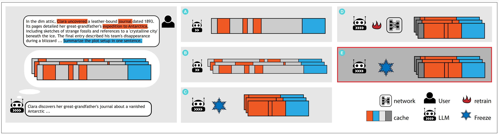

# ZeroMerge Project 🚀

 

A high-performance key-value merging utility with modular design and automated testing.

## Features ✨
- ​**ZeroMerge Core Module**: Efficient key-value cache merging algorithms
- ​**Extensible Testing**: Comprehensive unittest coverage
- ​**Script Automation**: Bash scripts for experiment replication
- ​**MIT Licensed**: Open and permissive usage

## Installation ⚙️

### Prerequisites
- Python 3.8+
- Bash shell (Linux/macOS/WSL)

### Install dependencies 

```bash
pip install -r requirements.txt
```

## Run 🛠️

### Create the Environment Variables File  
Create a `.env` file in the root directory of the project. Example content:   
```bash
ACCESS_TOKEN=your_huggingface_key_here  
```
### Running Tests

```bash
python -m unittest tests.test_mistral_att
python -m unittest tests.test_llama_att
python -m unittest tests.test_llama3_att
python -m unittest tests.test_falcon_att
```

### Validate throughput

```bash
bash scripts/e_throughput.sh
```

### Validate rouge

```bash
bash scripts/e_rouge.sh
```
## License 📄
This project is licensed under the MIT License - see the [LICENSE](./LICENSE) file for details.